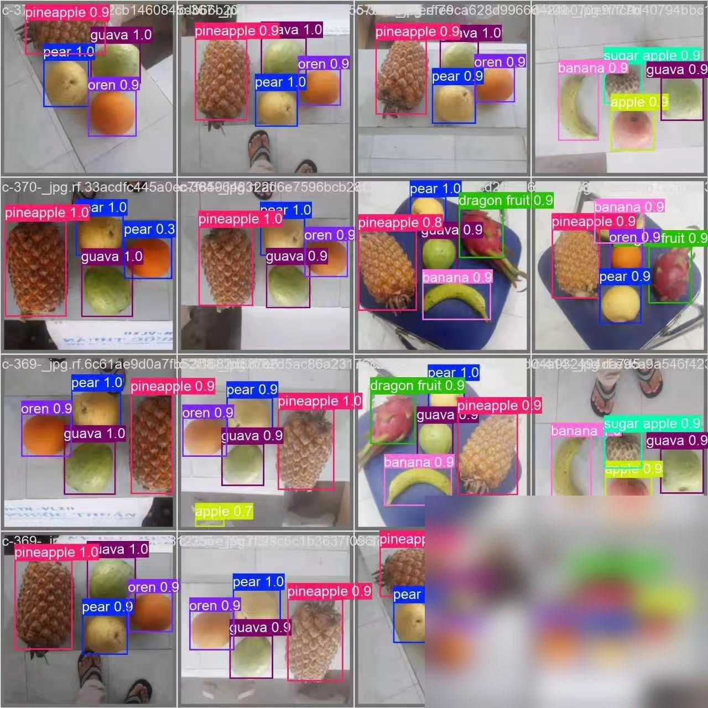
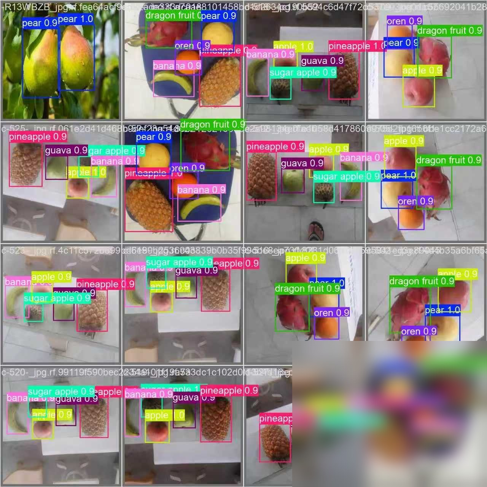
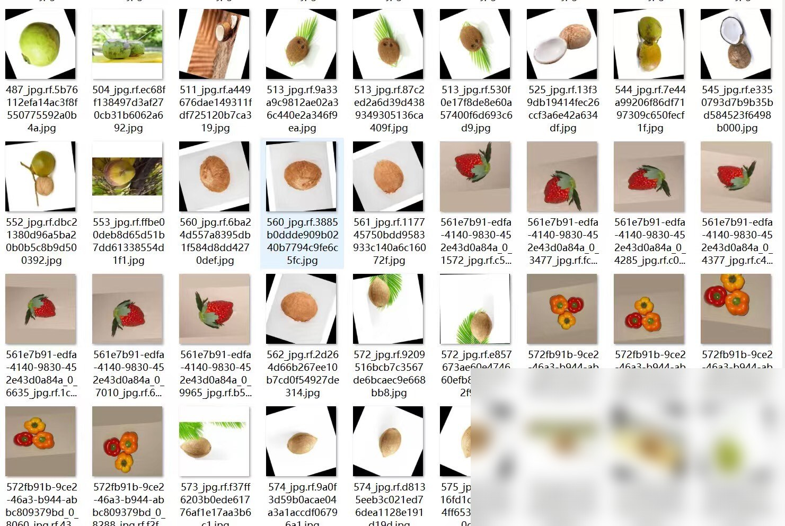
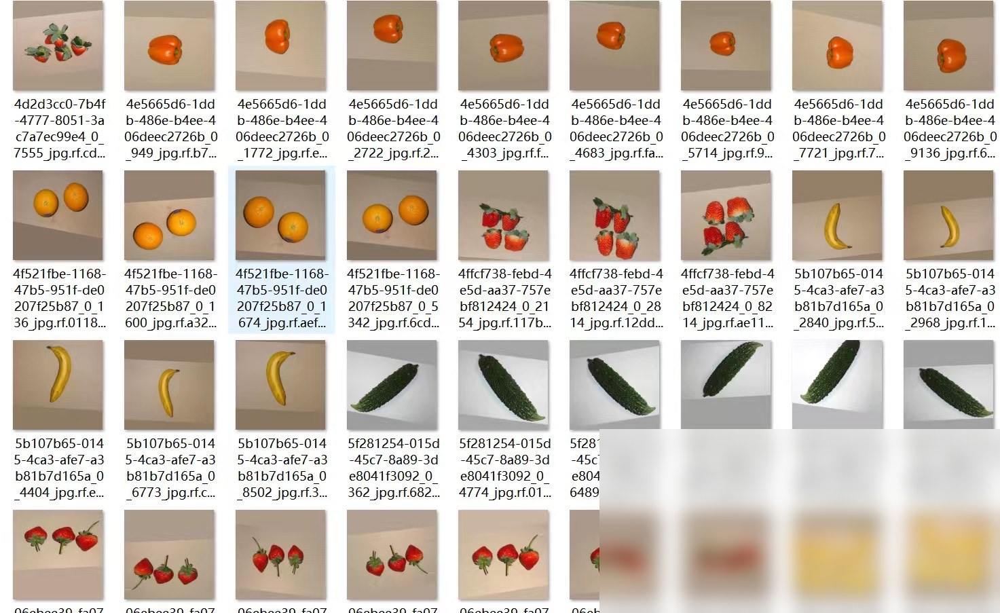

# Fruit and Vegetable Detection Dataset: 8100 Images Supporting Yolo

# Body

Fruit and Vegetable Detection Dataset: 8100 Images Supporting Yolo

The images are clear, with complete annotations, suitable for training object detection models, can be used directly.

Annotation
Category Name (Number of images per category, Number of annotations per category
Pear (1133, 1863
Cucumber (148, 259
Strawberry (702, 4342
Carrot (45, 45
Orange (369, 480
Banana (2534, 3956
Grapes (1076, 1403
Apple (1716, 2300
Coconut (422, 643

Here are the product technical requirements for each fruit

1. Lemon (Lemon): 136, 228
2. Bitter gourd (Bitter melon): 17, 17
3. Kiwi (Kiwifruit): 47, 108
4. Bell pepper (Chilli pepper): 100, 134
5. Dragon fruit (Dragon fruit): 1463, 1468
6. Sugar apple (Sugar apple): 1664, 1664
7. Oren (Orange): 1007, 1013
8. Guava (Guava): 1021, 1191
9. Pineapple (Pineapple): 1132, 1132

Zucchini (Cucurbita pepo): 18, 18
Garlic (garlic): 137, 274
Onion (onion): 144, 301
Green Chili (Sweet Chili): 173, 294
Potato (potato): 203, 325
Part of the original description was in Chinese and has been omitted.
Apricots (Prunus armeniaca): 251,767
Sponge Gourd (luffa): 64, 76
Cauliflower (broccoli): 118, 118
Calabash (Hylocereus undatus): 92, 92

Lady finger (eggplant): 148, 206
Cabbage (cabbage): 103, 103
Brinjal (eggplant): 68, 122
Capsicum (bell pepper): 68, 178
Bitter melon (watermelon rind): 137, 200
Ginger (ginger root): 82, 85
peach (peach): 656, 671

# Images

# Payment

Here is a pay link on Stripe ( https://buy.stripe.com/3cs8yP7sY87d0vu9AB ). Please contact me lonlonago@foxmail.com after funding $89, and I will send you a complete data files , thank you

Computer vision/deep learning algorithm services primarily focus on areas such as object detection, image segmentation, multimodal analysis, defect detection, face recognition, OCR, medical image analysis, autonomous driving perception, video understanding, behavior recognition, point cloud processing, image enhancement and restoration, image retrieval, and motion prediction.
Communication can be conducted based on specific tasks: model replication, algorithm optimization, performance improvement, model modification, code interpretation/code analysis, data processing, environment configuration, parameter tuning, experimental design, and result analysis, etc.
Core direction overview:
1. Object detection/tracking
Object detection, salient object detection, keypoint detection, lane line detection, point cloud object detection, point cloud segmentation, object tracking, motion detection, motion prediction.
2. Image segmentation/reconstruction
Image segmentation, semantic segmentation, medical image segmentation, geographic information segmentation, remote sensing data segmentation, 3D reconstruction, super-resolution reconstruction, point matching.
3. Face recognition/OCR/Industrial inspection
Face recognition, face detection, mask detection, license plate recognition, text recognition, OCR, defect detection, industrial inspection, anomaly detection.
4. Video understanding/behavior recognition
Video understanding, behavior recognition, pose estimation, gesture recognition, fight recognition, depth estimation, and autonomous driving perception.
5. Image enhancement/restoration
Image dehazing, image deraining, denoising, defogging, image restoration, and image compression.
6. Multimodal/large model related
The directions of multimodal, large model fine-tuning, algorithm analysis, and joint image-text representation are communicable.
Technology stack:
Inference frameworks: TensorRT, ONNX, OpenVINO
Common models/directions: YOLO, GAN, VIT, SLAM, diffusion models, etc. Discussions can be held based on project requirements.
Application fields:
For applications such as street view, medicine, remote sensing, daily scenes, industrial inspection, autonomous driving, and biomedical imaging, we can first discuss the specific requirements.
Individual work, suitable for developers with experience in computer vision, deep learning, algorithm replication, model optimization, code development, and project requirements.
The price is determined based on the difficulty and workload of the project.
Individual order receiving, quality guaranteed, after-sales service guaranteed. Welcome to directly send a private message to specify the specific task. We can communicate according to the specific task: model replication, algorithm optimization, performance improvement, model modification, code interpretation/code analysis, data processing, environment configuration, parameter tuning, experimental design and result analysis, etc.
Contact information: lonlonago@foxmail.com

